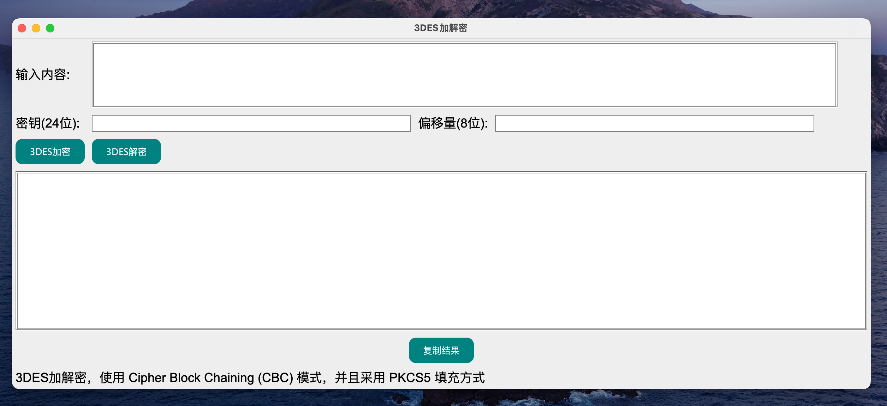
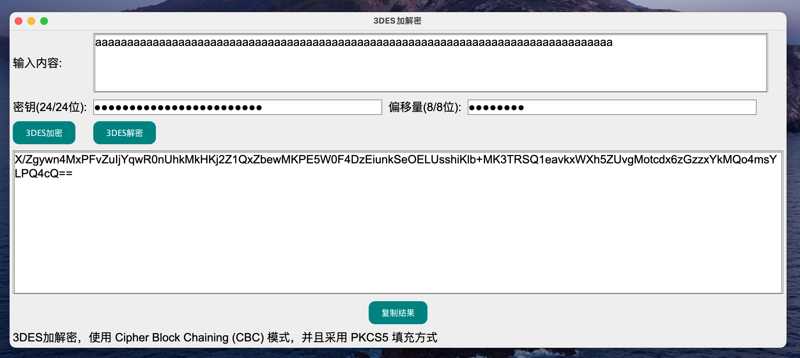
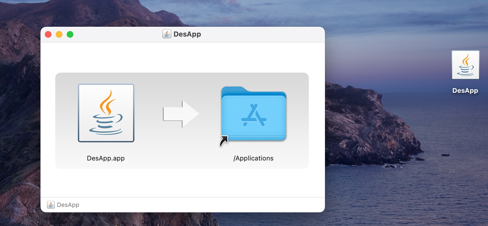

# DesApp

## 用swing做的一个简单的3des加解密的应用程序






> 打包jar, jdk版本>=1.8
>
> 打包成macos的应用app(dmg), 需要用到jdk版本14以后自带的`jpackage`

## 打包成macos APP

```shell
cd target
jpackage  --input ./jar  --name DesApp --main-jar DesApp-1.0.jar --main-class com.logan.DesApp --type dmg
```




